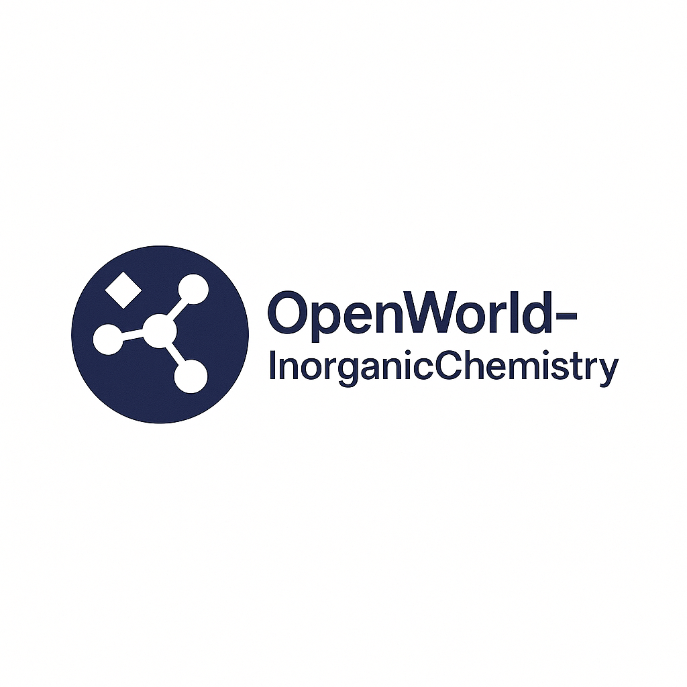

## OpenInorganicChemistry



Building better panels with fewer researchers. OpenInorganicChemistry is a macOS-compatible, Dockerizable Python research platform that automates solar materials workflows: literature review, synthesis planning, simulation, analysis, and reporting.

- Author: Nikhil Jois
- License: MIT

### Highlights
- OpenAI Agents SDK orchestration and OpenAI Responses API integration
- CLI (Typer + Rich) with interactive menu
- FastAPI service exposing all actions as HTTP endpoints
- Secure key handling (env, .env, macOS Keychain via keyring)
- Tests (pytest + tox) and CI (GitHub Actions)
- Dockerfile and Devcontainer

### Quickstart
1) Create a virtualenv and install
```bash
python3 -m venv .venv && source .venv/bin/activate
python -m pip install --upgrade pip
pip install -e ".[dev]"
```

2) Configure OpenAI API key
```bash
# Set environment variable OPENAI_API_KEY
# or copy .env.example to .env and set OPENAI_API_KEY there
# macOS users can run: scripts/configure_api_key_macos.sh
```

3) Run the CLI
```bash
oic
```

4) Run the API server
```bash
oic.api --host 127.0.0.1 --port 8000
# or: uvicorn openinorganicchemistry.api:app --reload
```

5) Run tests
```bash
tox
```

### Agents SDK
Install Agents SDK extras if you plan to use the orchestration command:
```bash
pip install .[agents]
```

### CLI Reference
```bash
oic                     # interactive menu
oic --help              # command help
oic doctor              # environment check
oic literature TOPIC
oic synth FORMULA
oic simulate TiO2 --backend emt --supercell 1
oic analyze path/to/results.csv
oic report RUN_ID
oic search "perovskite stability" --provider auto --max-results 5
oic codex "What affects perovskite stability?" --provider auto
```

### API Endpoints
- GET /health
- POST /agents/run {"text": "task"}
- POST /literature {"text": "topic"}
- POST /synthesis {"target": "formula"}
- POST /simulation {"formula": "Ti", "backend": "emt", "supercell": 1}
- POST /analysis {"path": "file.csv"}
- POST /report {"run_id": "..."}
- POST /search {"query": "...", "provider": "auto", "max_results": 5}
- POST /codex {"question": "...", "provider": "auto", "max_results": 5}

### Development
```bash
make deps
make test
make lint
make type
```

### Docker
```bash
docker build -t openinorganicchemistry:latest .
docker run --rm -it -e OPENAI_API_KEY -v "$PWD":/app openinorganicchemistry:latest oic
```

### Security
- Never commit secrets. Prefer env vars or macOS Keychain (keyring)

### License
MIT

